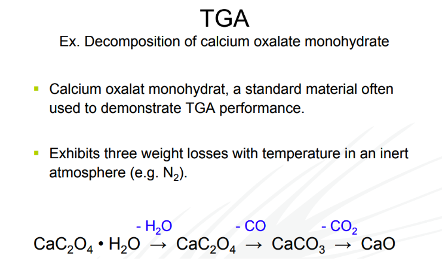
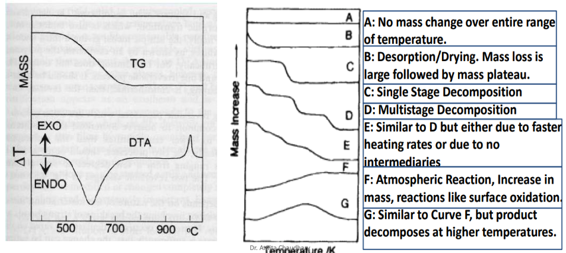
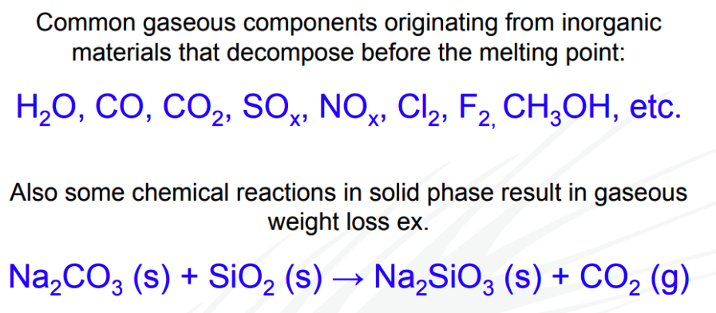
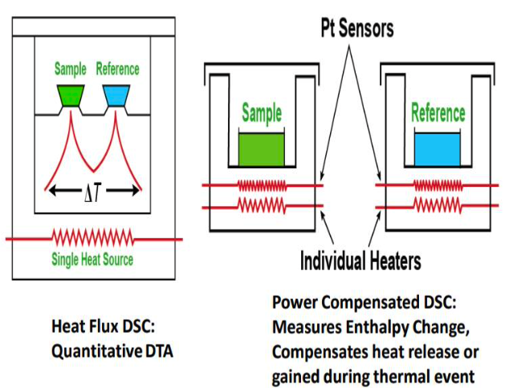

# Chapter 4 Physico-Chemical Analysis

- [video for X-Ray Diffraction](https://youtu.be/QHMzFUo0NL8)
- [Chapter pdf for thermal analysis](./4.%20Thermal%20Analysis.pdf)
- [Chapter notes for XRD](./4.%20XRD%20Notes.pdf)

# Thermal Analysis

- ## Thermal Method of Analysis
	- branch of analytical science where *properties of analysis are studied as they change with temperature*
	- **Thermogravimetric analysis (TGA)**
		- Experimental technique in which the mass of a sample is measured as function of sample temperature or time.
	- sample is typically
		- heated at a *constant heating rate* **[Dynamic measurement]** or
		- held at a *constant temperature* **[Isothermal measurement]**
	- results of a TGA measurement :
		- displayed as a TGA curve
		- mass or % mass is plotted against temperature.
		
- ## TGA basics
	- measures changes in weight in relation to changes in temperature
	- measured weight loss curve gives information about : 
		- **changes in** sample **composition**
		- **thermal stability**
		- **kinetic parameters** for chemical reactions in the sample
	- derivative weight loss curve used to tell the point at which weight loss is most apparent/obvious/clear.

- ## Several methods for analysis
	| Method | Quality measured |
	|---|---|
	| Thermogravimetric analysis (TGA) | **mass** |
	| Differential thermal analysis (DTA) | **temperature difference** |
	| Differential scanning calorimetry (DSC) | **heat difference** |
	| Pressurized TGA (PTGA) | **mass changes as function of pressure** |
	| Thermo mechanical analysis (TMA) | **deformations and dimension** |
	| Dilatometry (DIL) | **volume** |
	| Evolved gas analysis (EGA) | **gaseous decomposition products** |
	
	- different properties may be measured at the same time : TGA-DTA, TGA-EGA
		
- ## Mechanisms of weight change in TGA
	> all are kinetic process (there is a rate at which these occurs)
	- weight loss : *{DERD}*
		- Decomposition - breaking apart of chemical bonds
		- Evaporation - loss of volatiles with elevated temperature
		- Reduction - interaction of sample to a reducing atmosphere
			- hydrogen, ammonia etc.
		- Desorption - release of an absorbed substance from a surface
	- weight gain : *{OA}*
		- Oxidation - interaction of the sample with an oxidizing atmosphere
		- Absorption / Adsorption : soaking up/ solid holds molecule of liquid or gas as a thin film.
		
- ## TGA phenomena causing mass changes
	- physical 
		- gas adsorption
		- gas desorption
		- phase transitions
			- vaporization
			- sublimation
	- chemical
		- decomposition
		- break down reactions
		- gas reactions
		- chemisorption
	
- ## Applications of TGA
	- characterization of 
		- thermal **stability** 
		- material **purity**
		- determination of **humidity**
	- Examination of 
		- **corrosion** studies
		- **gasification** processes
		- **kinetic** processes
		
	- principle uses of TGA : measurement of a materia's **thermal stability** and its **composition**
		- Filler content of polymer resins
		- Residual solvent content
		- Carbon black content
		- Decomposition temperature
		- Moisture content of organic and inorganic materials 
		- Plasticizer content of polymers
		- Oxidative stability
		- Performance of stabilizers
		- Low molecular weight monomers in polymers
		
	- what TGA can tell you : *{TOC LD RM}*
		- Thermal stability
			> Thermal Stability of Materials: Explicate decomposition mechanism, fingerprint materials for identification & quality control
		- Oxidative stability 
			> Oxidative Stability of Materials: Oxidation of metals in air, Oxidative decomposition of organic substances in air/O2, Thermal decomposition in inert atmosphere
		- Composition of multi-component system
			> Composition of Multi-component Systems: Behaviors sufficiently different on the temperature scale can be identified and reaction mechanism formulated
		- Lifetime of product
			> Estimated Lifetime of a Product: Related to thermal stability
		- Decomposition kinetics 
			> Decomposition Kinetics of Materials: Rate of reaction, Activation Energy
		- Reactive or corrosive atmosphere on materials
			> The Effect of Reactive or Corrosive Atmospheres on Materials: Oxidation & Corrosion Studies
		- Moisture and volatiles content
			> Moisture and Volatiles Content of Materials: Loss of moisture, drying, desorption
		- decomposition of calcium oxalate monohydrate
			> 
		- TGA
			> 
		- decomposition before melting point and solid-gaseous weight loss
			> 
			
- ## Factors affecting the TG curve
	- Increases the **temperature** at which sample decomposition occurs
		- Heating rate
		- Sample size
	- Affects the **progress** of thier reaction
		- Particle size of sample
		- Packing
		- Crucible shape
		- Gas flow rate
- ## Types of TGA
	- Dynamic TGA
		- sample is subjected to conditions of **continuous incrase in temperature** ususally linear with time
	- Isothermal or static TGA
		- sample is maintained at a **constant temperature** for a period of time during which any change in weight are noted

- ## Principle of TGA
	- gradually raising the temperature of a sample
		> in a furnace *as it's*
	- weight is measured on an analytical balance
		> that remains outside of the furnace.
	- mass loss is observed if a thermal event involves loss of a volatile component
	- Cumbustion like chemical reactions involves mass losses
		> Melting like physical changes do not involve mass loss.
	- weight of the sample is plotted against temperature or time
		- to illustrate thermal transitions in the material
		- loss of solvent and plasticizers in polymers, water of hydration in inorganic materials.
		- curve called thermogravimetric curve or thermogram
	- decomposition of material

- ## Differential Scanning Calorimetry (DSC)
	- *measures* the difference in heat flow (mW = mJ/sec)
	- *between* sample and inert reference 
	- as a *function* of time and temperature
	
	
	- relies on the measurement of the difference between 
		- the heat flow vs. temperature relation of the **sample**
		- the heat flow vs. temperature relation of a **standard**
	
	- types of calorimeters and criteria for classification
		- ranges of temperatures, pressure range
			- high temp/pressure or low temp/pressure
		- type of the test process
			- measure heat of mixing, heat capacity
		- thermodynamic conditions
			- adiabatic, non-adabatic
			> adiabatic : relating to or denoting a process or condition in which heat does not enter or leave the system concerned.
		- sample weight change during the measurement
			- open (mass transfer/exchange)
			- closed (no mass transfer)
	
- ## Types of DSC
	- Flow (Heat flux DSC)
		- directly measured signal is a change in temperature between a test sample and a reference sample
		- difference is proportional to the flow of the heat flux between the two samples
		- automatically converted to the value of the heat flux using special software.
		- **heat flux remains constant**
	- Compensation (Power compensation DSC)
		- consist of two identical and isolated heaters located in the same temperature
			> one in tested sample, another in reference sample
		- Temperature changes during the phase transformation or the reaction in the sample are compensated by varying the electrical energy supplied to the heater
		- its directly proportional to the heat absorbed during the process
		- **power supply remains constant**
	
	> 
# XRD 