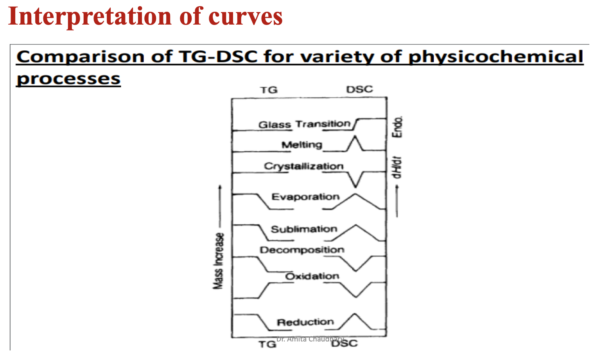
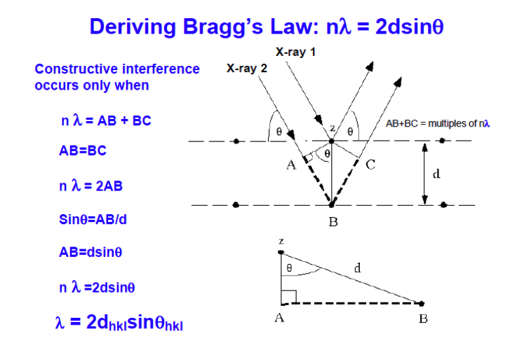

# Chapter 4 Physico-Chemical Analysis

- [video for X-Ray Diffraction](https://youtu.be/QHMzFUo0NL8)
- [Chapter pdf for thermal analysis](./4.%20Thermal%20Analysis.pdf)
- [Chapter notes for XRD](./4.%20XRD%20Notes.pdf)

# Thermal Analysis

- ## Thermal Method of Analysis
	- branch of analytical science where *properties of analysis are studied as they change with temperature*
	- **Thermogravimetric analysis (TGA)**
		- Experimental technique in which the mass of a sample is measured as function of sample temperature or time.
	- sample is typically
		- heated at a *constant heating rate* **[Dynamic measurement]** or
		- held at a *constant temperature* **[Isothermal measurement]**
	- results of a TGA measurement :
		- displayed as a TGA curve
		- mass or % mass is plotted against temperature.
		
- ## TGA basics
	- measures changes in weight in relation to changes in temperature
	- measured weight loss curve gives information about : 
		- **changes in** sample **composition**
		- **thermal stability**
		- **kinetic parameters** for chemical reactions in the sample
	- derivative weight loss curve used to tell the point at which weight loss is most apparent/obvious/clear.

- ## Several methods for analysis
	| Method | Quality measured |
	|---|---|
	| Thermogravimetric analysis (TGA) | **mass** |
	| Differential thermal analysis (DTA) | **temperature difference** |
	| Differential scanning calorimetry (DSC) | **heat difference** |
	| Pressurized TGA (PTGA) | **mass changes as function of pressure** |
	| Thermo mechanical analysis (TMA) | **deformations and dimension** |
	| Dilatometry (DIL) | **volume** |
	| Evolved gas analysis (EGA) | **gaseous decomposition products** |
	
	- different properties may be measured at the same time : TGA-DTA, TGA-EGA
		
- ## Mechanisms of weight change in TGA
	> all are kinetic process (there is a rate at which these occurs)
	- weight loss : *{DERD}*
		- Decomposition - breaking apart of chemical bonds
		- Evaporation - loss of volatiles with elevated temperature
		- Reduction - interaction of sample to a reducing atmosphere
			- hydrogen, ammonia etc.
		- Desorption - release of an absorbed substance from a surface
	- weight gain : *{OA}*
		- Oxidation - interaction of the sample with an oxidizing atmosphere
		- Absorption / Adsorption : soaking up/ solid holds molecule of liquid or gas as a thin film.
		
- ## TGA phenomena causing mass changes
	- physical 
		- gas adsorption
		- gas desorption
		- phase transitions
			- vaporization
			- sublimation
	- chemical
		- decomposition
		- break down reactions
		- gas reactions
		- chemisorption
	
- ## Applications of TGA
	- characterization of 
		- thermal **stability** 
		- material **purity**
		- determination of **humidity**
	- Examination of 
		- **corrosion** studies
		- **gasification** processes
		- **kinetic** processes
		
	- principle uses of TGA : measurement of a materia's **thermal stability** and its **composition**
		- Filler content of polymer resins
		- Residual solvent content
		- Carbon black content
		- Decomposition temperature
		- Moisture content of organic and inorganic materials 
		- Plasticizer content of polymers
		- Oxidative stability
		- Performance of stabilizers
		- Low molecular weight monomers in polymers
		
	- what TGA can tell you : *{TOC LD RM}*
		- Thermal stability
			> Thermal Stability of Materials: Explicate decomposition mechanism, fingerprint materials for identification & quality control
		- Oxidative stability 
			> Oxidative Stability of Materials: Oxidation of metals in air, Oxidative decomposition of organic substances in air/O2, Thermal decomposition in inert atmosphere
		- Composition of multi-component system
			> Composition of Multi-component Systems: Behaviors sufficiently different on the temperature scale can be identified and reaction mechanism formulated
		- Lifetime of product
			> Estimated Lifetime of a Product: Related to thermal stability
		- Decomposition kinetics 
			> Decomposition Kinetics of Materials: Rate of reaction, Activation Energy
		- Reactive or corrosive atmosphere on materials
			> The Effect of Reactive or Corrosive Atmospheres on Materials: Oxidation & Corrosion Studies
		- Moisture and volatiles content
			> Moisture and Volatiles Content of Materials: Loss of moisture, drying, desorption
		- decomposition of calcium oxalate monohydrate
			> 
		- TGA
			> 
		- decomposition before melting point and solid-gaseous weight loss
			> 
			
- ## Factors affecting the TG curve
	- Increases the **temperature** at which sample decomposition occurs
		- Heating rate
		- Sample size
	- Affects the **progress** of thier reaction
		- Particle size of sample
		- Packing
		- Crucible shape
		- Gas flow rate
- ## Types of TGA
	- Dynamic TGA
		- sample is subjected to conditions of **continuous incrase in temperature** ususally linear with time
	- Isothermal or static TGA
		- sample is maintained at a **constant temperature** for a period of time during which any change in weight are noted

- ## Principle of TGA
	- gradually raising the temperature of a sample
		> in a furnace *as it's*
	- weight is measured on an analytical balance
		> that remains outside of the furnace.
	- mass loss is observed if a thermal event involves loss of a volatile component
	- Cumbustion like chemical reactions involves mass losses
		> Melting like physical changes do not involve mass loss.
	- weight of the sample is plotted against temperature or time
		- to illustrate thermal transitions in the material
		- loss of solvent and plasticizers in polymers, water of hydration in inorganic materials.
		- curve called thermogravimetric curve or thermogram
	- decomposition of material

- ## Differential Scanning Calorimetry (DSC)
	- *measures* the difference in heat flow (mW = mJ/sec)
	- *between* sample and inert reference 
	- as a *function* of time and temperature
	
	
	- relies on the measurement of the difference between 
		- the heat flow vs. temperature relation of the **sample**
		- the heat flow vs. temperature relation of a **standard**
	
	- types of calorimeters and criteria for classification
		- ranges of temperatures, pressure range
			- high temp/pressure or low temp/pressure
		- type of the test process
			- measure heat of mixing, heat capacity
		- thermodynamic conditions
			- adiabatic, non-adabatic
			> adiabatic : relating to or denoting a process or condition in which heat does not enter or leave the system concerned.
		- sample weight change during the measurement
			- open (mass transfer/exchange)
			- closed (no mass transfer)
	
- ## Types of DSC
	- Flow (Heat flux DSC)
		- directly measured signal is a change in temperature between a test sample and a reference sample
		- difference is proportional to the flow of the heat flux between the two samples
		- automatically converted to the value of the heat flux using special software.
		- **heat flux remains constant**
	- Compensation (Power compensation DSC)
		- consist of two identical and isolated heaters located in the same temperature
			> one in tested sample, another in reference sample
		- Temperature changes during the phase transformation or the reaction in the sample are compensated by varying the electrical energy supplied to the heater
		- its directly proportional to the heat absorbed during the process
		- **power supply remains constant**
	
	> 
	
- result of calorimetric measurements is a DSC curve shown as the temperature / time dependence on the heat flux (per time unit)
	- temperaturetested < temperaturereference during phase transformation/reaction, HEAT IS ABSORBED. situation is registered as **ENDOTHERMIC PEAK**.
	- sample temperature is higher, and there is separation of the heat : **EXOTHERMIC PEAK**.
	
- ## DSC Heat flow
	- dH/dt = Cp DT/dt
		- dH : DSC heat flow signal
		- Cp : Sample Heat Capacity
			- sample specific heat x sample weight
		- dT/dt : heating rate

	- Heat flows into the sample as a result of either 
		- heat capacity (heating)
		- glass transition 
		- melting
		- evaporation
		- other endothermic processes
	- Heat flows out of the sample as a result of either
		- heat capacity (cooling)
		- cystallization
		- curing
		- oxidation
		- other exothermic processes
	
- ## Enthalpy of transition
	- area under the peaks in the curve can be use to calculate the enthalpy of transition
	- ∆𝐻 = 𝐾𝐴
		- ∆𝐻 = Change in Enthalpy
	
		- K = calorimetric Constant
		- A = Area under the peak (by integration of peak)

	- Area under the peak is directly proportional to the heat evolved or absorbed in a reaction. 
	- Height of the peak represents the rate of reaction.

	- DSC measurements can be made in two ways: by measuring the electrical energy provided to heaters below the pans necessary to maintain the two pans at the same temperature (power compensation), or by measuring the heat flow (differential temperature) as a function of sample temperature (heat flux). The DSC ultimately outputs the differential heat flow (heat/time) between your material and the empty reference pan. Heat capacity may be determined by taking the ratio of heat flow to heating rate. Thus,
	- Cp = q/∆T
	- where Cp is the material’s heat capacity, q is the heat flow through the material over a given time, and ∆T is the change in temperature over that same time.
	
	> 
	
# XRD 

- Essential Condition for diffraction
	- nλ = 2dsinθ
	> Bragg law
- X rays are electromagnetic radiation of wavelength in the range of 0.5 to 2.5 Å
	- wave nature λ =  c/v
	- particle nature E = hv
- X-Ray diffraction
	- Braggs law (part 1)
		- for every diffracted beam there exists a set of cystal lattice planes such that the diffracted beam appears to be specularly reflected from this set of plans.
		- call the diffraction a reflection
		
	- **differences in length of path traveled => differences in phase**
	- **phase difference => amplitude changes**

- Crystak structure for X ray diffraction peaks
	|Bravais lattice|Reflection present|Reflection absent|
	|---|---|---|
	|simple|all|none|
	|base centered|h and k unmixed|h and k mixed|
	|body centered|(h+k+l) even|(h+k+l) odd|
	|face centered|h k and l unmixed|h k and l mixed|
	
- why XRD
	- [SPACING] to measure average spacings b/w layers/rows/atoms
	- [ORIENTATION] to determine orientation of single crystal or grain
	- [STRUCTURE] to find crystal structure of unknown material
	- [SIZE/SHAPE/STRESS] to measure size, shape, internal stress of small crystalline regions

- specular reflectin : angle of incidence = angle of reflection
	>  (measured from the plan)
- Bragg's law (part 2)
	- nλ = 2dhklsinθ

	> 
	
- ## What is XRD 
	- powerful non-destructive technique for characterizing crystalline materials.
	- provides information on structures, phases, preferred crystal orientations and other structural parameters.
		- such as average grain size, crystallinity, strain and crystal defects.
	- XRD peaks are produced by *constructive interference of a monochromatic beam* of X-rays *scattered at specific angles* from each set of lattice planes in a sample.
	- peak *intensities are determined by the atomic positions* within the lattice planes.
	- XRD pattern is the *fingerprint of periodic atomic arrangements* in a given material.
	- online search of standard database for X-ray powder diffraction pattern enables : *quick phase identification* for a large variety of crystalline samples.
- ## Working of XRD
	- is based on bragg's law *(nλ = 2d<sinθ)*
	- monochromatic beam of X-rays is allowed to incident on a sample
	- reflected X rays are detected by a detector.
	- this technique is useful in determining the percent crystallinity in the natural fibers 
		> before and after physical and chemical treatment.
	> *X-ray diffractogram of rthe sample is recorded on an X-ray diffractometer operating at known voltages and current using a Cu Ka X rays (λ = 0.15406 nm) over the 2θ range from 10 to 100 degrees in the steps of 0.01 degree at room temperature in open quartz sample holders.*
	- *Amorphous* regions of the samples produce *broad* peaks.
	- *Crystalline* regions produce *sharp* peaks.
	- Degree of crystallinity (Xc) can be determined by determining the intensities of the crystalline (Ic) and amorphous (Ia) contents in the sample
		- Xc = Ic * 100 / Ia + Ic 
	
- ## X-ray Powder Diffraction
	- *rapid analytical technique* primarily *used for phase identification* of a crystalline material
	- provide information on unit cell dimensions
	- analyzed material is *finely ground*, *homogenized*, and *average bulk composition is determined*
	
- ## Fundamental principles
	- *Max von Laue, in 1912, discovered that crystalline substances act as three-dimensional diffraction gratings for X-ray wavelengths similar to the spacing of planes in a crystal lattice. These X-rays are generated by a cathode ray tube, filtered to produce monochromatic radiation, collimated to concentrate, and directed toward the sample. The interaction of the incident rays with the sample produces constructive interference (and a diffracted ray) when conditions satisfy Bragg's Law (nλ=2d sin θ). This law relates the wavelength of electromagnetic radiation to the diffraction angle and the lattice spacing in a crystalline sample. These diffracted X-rays are then detected, processed and counted. By scanning the sample through a range of 2θangles, all possible diffraction directions of the lattice should be attained due to the random orientation of the powdered material.*

- ## X-ray Powder Diffraction (XRD) Instrumentation
	- how does it work?
	- X-ray diffractometers consist of three basic elements : 
		1. X-ray tube
		2. sample holder
		3. X-ray detector
	- specific wavelengths are characteristic of the target material *(Cu, Fe, Mo, Cr)*
	- Filtering, by foils or *crystal monochrometers, is required to produce monochromatic X-rays* needed for diffraction.
	- *Copper* is the most common target material for *single-crystal diffraction*,
		- ith CuKα radiation = 1.5418Å.
		- X-rays are collimated(parallel) and directed onto the sample
		- As the sample and detector are rotated => the intensity of the reflected X-rays is recorded
		- When the geometry of the incident X-rays impinging(affects) the sample satisfies the Bragg Equation, *constructive interference* occurs and a peak in intensity occurs.
		- *detector* **records and processes** this X-ray signal **converts** the signal to a count rate which is then **output** to a device such as a printer or computer monitor.
		-  *The geometry of an X-ray diffractometer is such that the sample rotates in the path of the collimated X-ray beam at an angle θ while the X-ray detector is mounted on an arm to collect the diffracted X-rays and rotates at an angle of 2θ. The instrument used to maintain the angle and rotate the sample is termed a goniometer. For typical powder patterns, data is collected at 2θ from ~5° to 70°, angles that are preset in the X-ray scan.*
	
- ## Applications
> widely used for 
- identification of unknown crystalline materials
	- e.g. minerals, inorganic compounds
- determination of unknown solids
	- which is critical to studies in geology, environmental science, material science, engineering and biology.
- characterization of crystalline materials
- identification of fine-grained minerals such as clays and mixed layer clays that are difficult to determine optically
- determination of unit cell dimensions
- measurement of sample purity

- ## Strengths and Limitations of X-ray Powder Diffraction
	- Strengths
		- **Powerful** and **rapid** (< 20 min) technique *for identification of an unknown mineral* 
		- In most cases, it **provides an unambiguous mineral determination**
		- **Minimal sample preparation** is required
		- XRD **units are widely available**
		- Data **interpretation is** relatively **straight forward** 
	- Limitations
		- *Homogeneous* and *single phase material* is best for identification of an unknown
		- Must have *access to a standard reference* file of inorganic compounds (d-spacings, hkls)
		- *Requires tenths of a gram of material* which must be ground into a powder
		- For mixed *materials, detection limit is ~ 2%* of sample
		- For unit cell determinations, *indexing* of patterns for non-isometric crystal systems *is complicated*
		- *Peak overlay may occur* and worsens for high angle 'reflections'
	
- ## Sample collection and preparation
	- Determination of an unknown requires:
		- Requirement: The sample **material**, an **instrument** for grinding, and a **sample holder**.
		- **Obtain** a few tenths of a gram (or more) of the material, as pure as possible
		- **Grind** the sample to a fine powder, typically in a fluid to minimize inducing extra strain (surface energy) that can offset peak positions, and to randomize orientation. Powder less than ~10 μm(or 200-mesh) in size is preferred
		- **Place into a sample holder** or onto the sample surface: Packing of fine powder into a sample holder.
 
- ## Determination of unknown substance
	- The d-spacing of each peak is then obtained by solution of the Bragg equation for the appropriate value of λ. 
	- Once all d-spacings have been determined, automated search/match routines compare the ds of the unknown to those of known materials. 
	- Because each mineral has a unique set of d-spacings, matching these d-spacings provides an identification of the unknown sample. A systematic procedure is used by ordering the d-spacings in terms of their intensity beginning with the most intense peak. Files of d-spacings for hundreds of thousands of inorganic compounds are available from the International Centre for Diffraction Data as the Powder Diffraction File (PDF). Many other sites contain d-spacings of minerals such as the American Mineralogist Crystal Structure Database. Commonly this information is an integral portion of the software that comes with the instrumentation.
	
- ## Numerical 
	- d = a/√(h2 + kk + l2)
		- h,k,l : plane variables
		- a = lattice constant
		- d = thickness
	
		