# Chapter 5 Application of Analytical Techniques

- [video for SEM and TEM](https://youtu.be/ys-7ydEH6gs)

- Electron microscope
	- 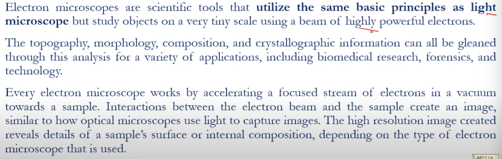
	- utilize the same basic principles as light microscope
	- topography, morphology, composition and crystallographic information can be obtained throgh this analysis for a variety of applications
	- works by accelerating a focused stream of electrons in a vaccume towards a sample.
	- high resolution image reveals details of a sample's surface or internal composition.

- TEM (Transmission Electron Microscope)
	> 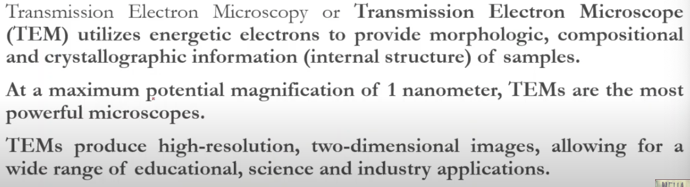
	
	> Enables examination of internal structure
	
	- utilizes energetic electrons to provide :
		- **morphological**
		- **compositional**
		- **crystallographic** information
	- max potential magnification of **1 nanometer**
	- high resolution **2D** image
	- application in educational, scienece and industry.
	
	> 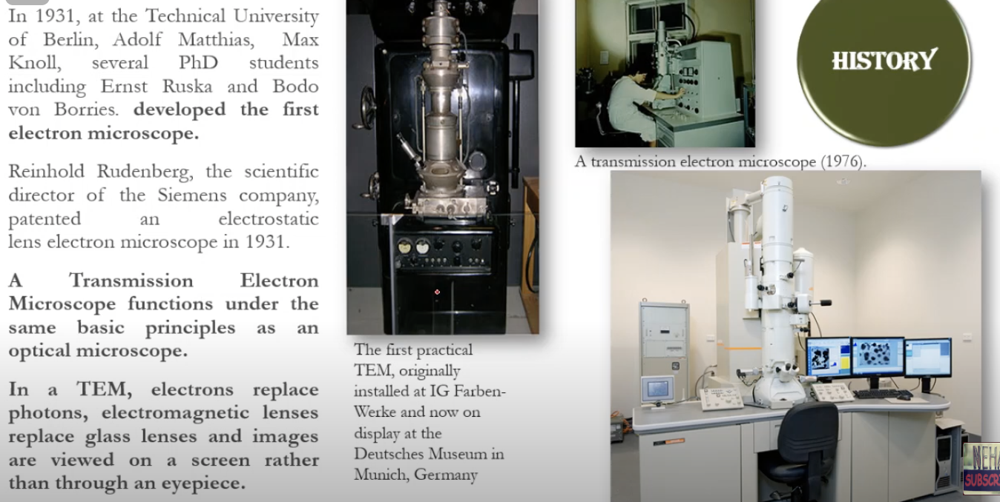
	
	- sample is in between the coils and while in the sem the sample will be at the bottom of the coils
	
	> [TEM working](./assets/tem-working.png)
	- parts : 
		- electron source
		- anode
		- condensor lenses
		- sample
		- objective lens
		- intermediate lens
		- projector lens
		- flurescent screen
		
- SEM (Scanning Electron Microscope) *(Sem - Surface)*
	> 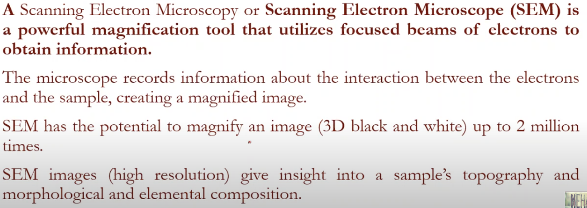
	
	> Scans the surface of material 
	- utilized focused beams of electrons to obtain information
	- interaction between the electrons and the sample
	- magnify **3D** image upto **2 million** times.
	- give insight into sample's :
		- **topology**
		- **morphological**
		- **elemental** composition.
	> 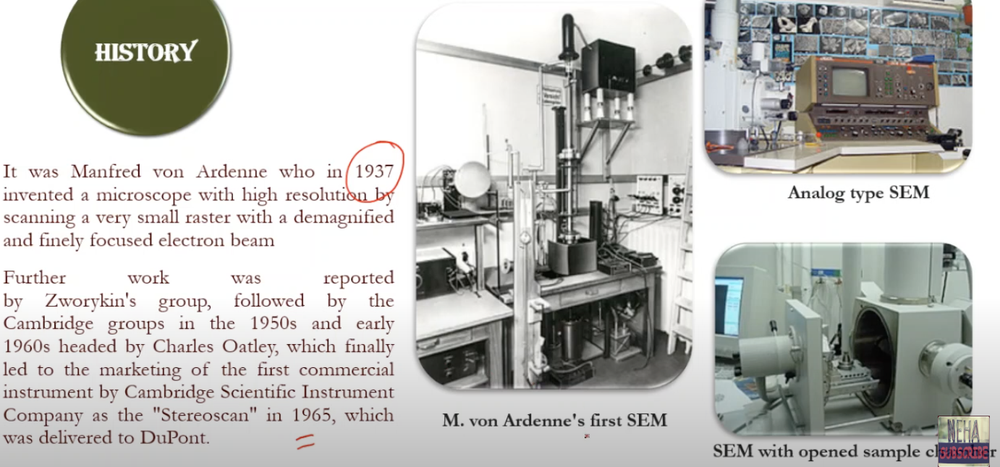
	
	- **Sample preparation of SEM**
		> 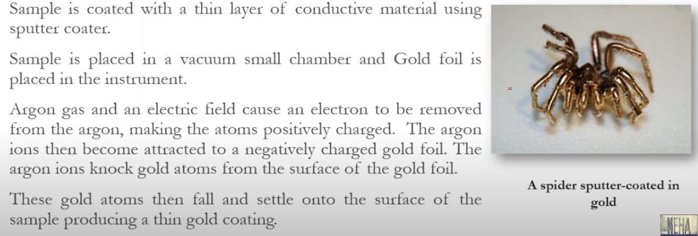
		- coated with thing layer of conductive material using **sputter coater**.
		- placed in vacuum small chamber
		- gold foil is placed in instrument
		- **Argon** gas, electric field cause an electrong to be removed from argon, making the atoms positively charged.
		- gold atoms settle onto the surface of the sample producing a thing gold coating after falling.
		
	> 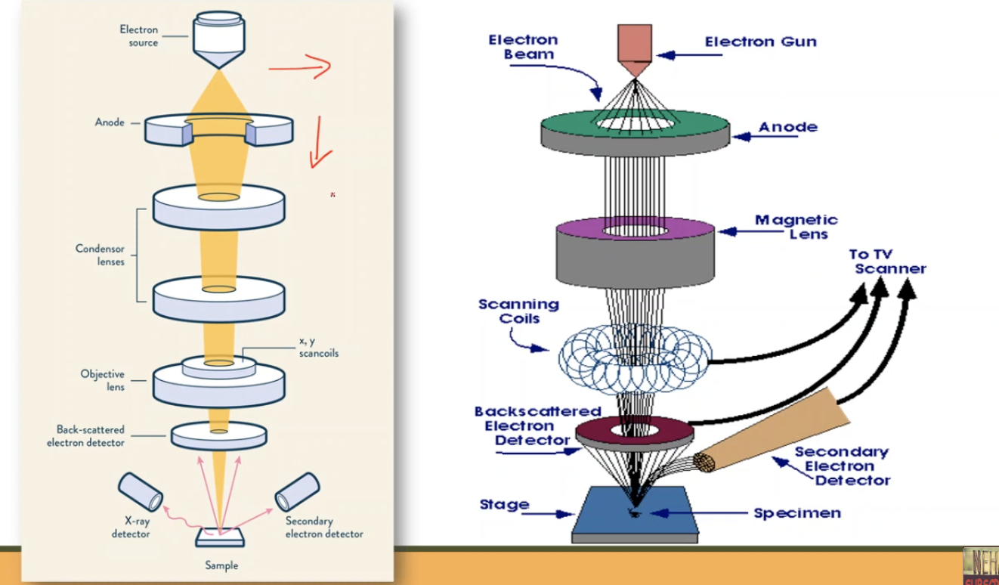
	- parts :
		- electron source
		- anode
		- condensor lenses x2
		- Objective lens | x, y scan coils
		- Back-scattered electron detector
		- X-ray detector | sample | secondary electron detector
		
	- electron gun produces elecron beam
	- tungstun wire heated by the current
	
	> 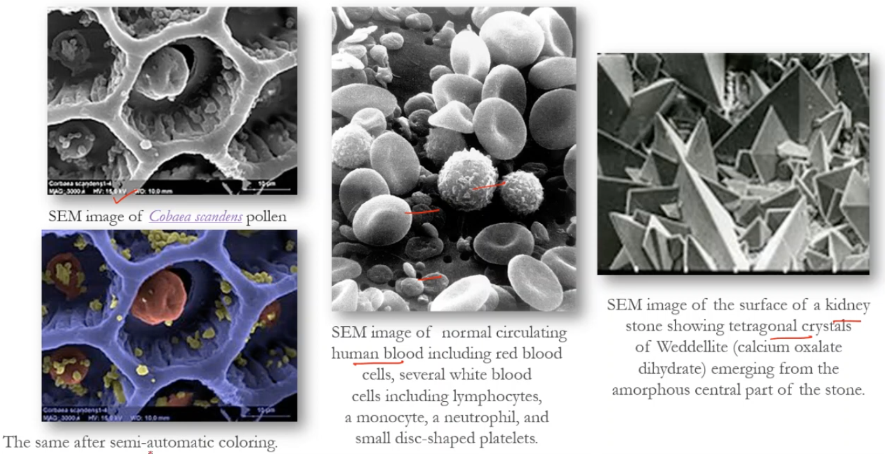
	
## SEM vs TEM

> 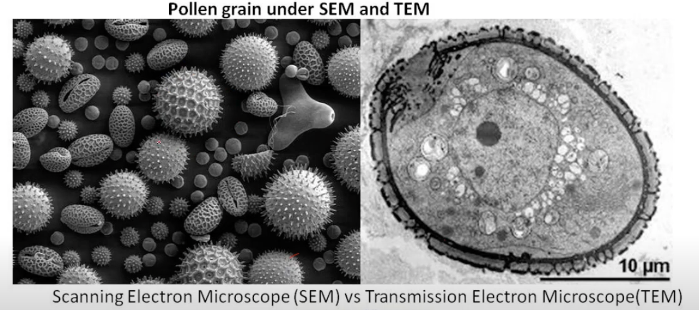

> 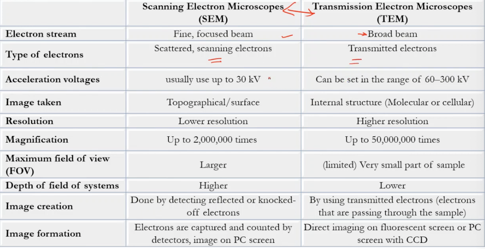

> 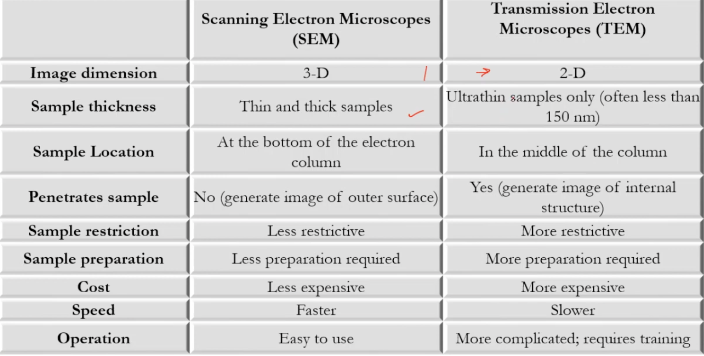

## Applications of sem and tem

> MS SC MA FI *(mask mafi)*

> BS GI MS TC *(bus gai mars tac)*

- material science
- semi conductors
- microchip assembly
- forensic investigation

- biological science
- Geology identification
- medical science
- technology companies

> 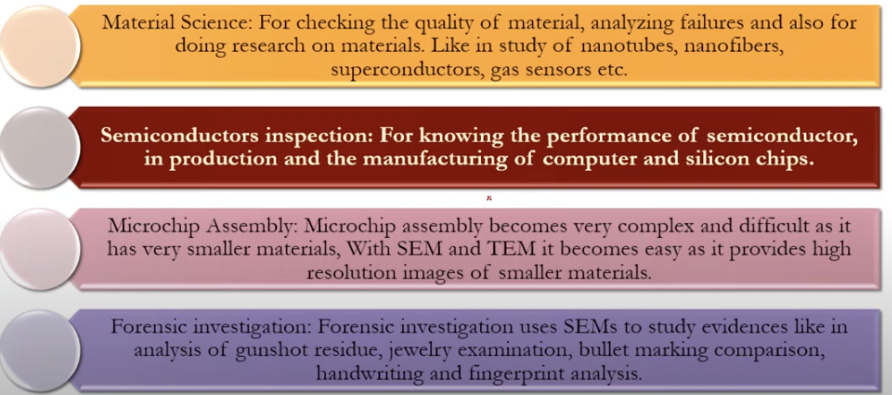
> 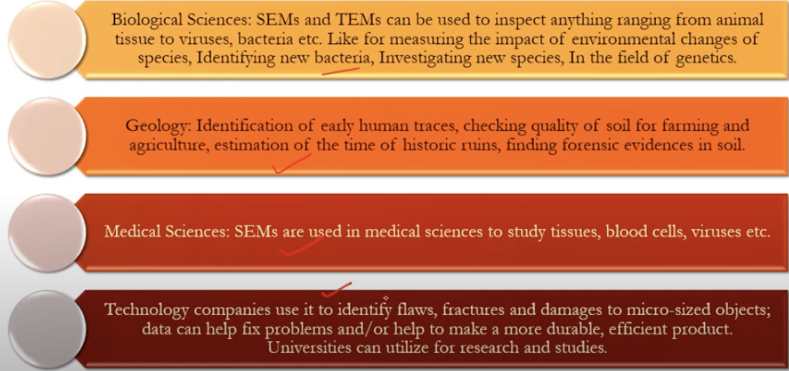