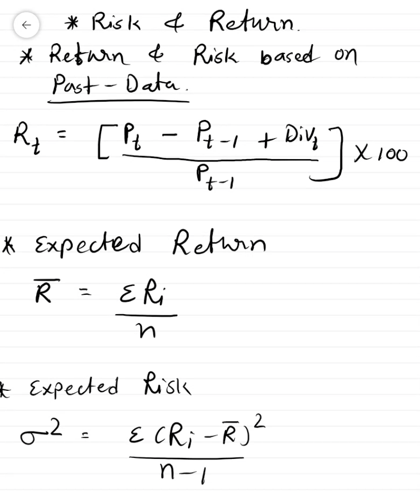

# Risk and Return

- Using previous data

- Using probabilities 

- What is portfolio : 
	- an investment made in more than one stock, in combination of securities.
	- main objective of the portfolio, is you can get good return with less risk

- QUESTION : 5
	- An investor is offered following four stocks. An analyst has assigned the
	following probabilities to each stock, based upon their likely performance in the
	coming year along with their returns.
	Probabilit
	y
	CIPL
	A
	Probabilit
	y GAIL
	Probabilit
	y HCL
	Probabilit
	y HDFC
	0.2 -45.73 0.15 56.02 0.2 -13.2 0.1 66.82
	0.4 -9.32 0.35 -6.76 0.4 -52.44 0.25 -1.78
	0.3 34.53 0.45 -12.85 0.3 12.07 0.4 -6.54
	0.1 32.05 0.05 49.1 0.1 68.82 0.25 -10.45
	
- (a) Are these stocks attractive investments with the given probabilities? Give
Reasons
	- estimated return r bar 
		- in all case highest probability,  the returns are negative
		- avg r bar expected returns are positive
			> then attractive.
- (b) Which stock would you prefer to buy and why?
	- 