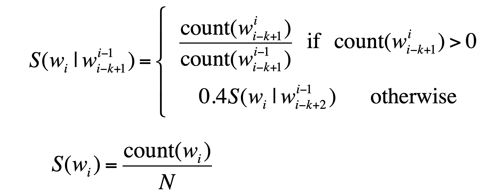

# NLP Syllabus
 > *(topics covered 😳)*

- ## Introduction to NLP
	- Natural Language Processing, or NLP is a subfield of Artificial Intelligence research that is focused on developing models and points of interaction between humans and computers based on natural language. This includes text, but also speech-based systems.
	- Computer scientists and researchers have been studying this topic for entire decades, but only recently has it become a hot topic again, a situation made possible by recent breakthroughs in the research community.
	- The ultimate goal of NLP is to help computers understand language as well as we do. It is the driving force behind things like virtual assistants, speech recognition, sentiment analysis, automatic text summarization, machine translation and much more.
	-  Applications of NLP techniques include voice assistants like Amazon's Alexa and Apple's Siri, but also things like machine translation and text-filtering.
	> How Natural Language Processing works
		- *A generally accepted truth in computer science is that every complex problem becomes easier to solve if we break it into smaller pieces. That is especially true in the Artificial Intelligence field. For a given problem, we build several small, highly specialized components that are good at solving one and only one problem. We then align all this components, we pass our input through each component and we get our output at the end of the line. This is what we call a pipeline.*
		- *In the NLP context, a basic problem would be that for a given paragraph, the computer understands exactly the meaning of it and then possibly it acts accordingly. For this to work, we need to go through a few steps.*
- ## [Applications of NLP](https://monkeylearn.com/blog/natural-language-processing-applications/)
	- Sentiment Analysis
	- Text Classification
	- Text Summarization
	- Text Extraction
	- Chatbots & Virtual Assistants
	- Machine Translation
	- Market Intelligence
	- Auto-Correct
	- Intent Classification
	- Urgency Detection
	- Speech Recognition
	
- ## [Tasks of NLP](https://monkeylearn.com/natural-language-processing/#:~:text=Common%20NLP%20Tasks%20%26%20Techniques)
	- Syntactic analysis *(parsing or syntax analysis)*
	- Semantic analysis
	- Tokenization
	- Part-of-speech tagging
	- Dependency Parsing
	- Constituency Parsing
	- Lemmatization & Stemming
	- Stopword Removal
	- Word Sense Disambiguation
	- Named Entity Recognition (NER)
	
- ## [NLP Challenges](https://www.analyticsinsight.net/10-major-challenges-of-using-natural-language-processing/)
	- Development Time
	- Phrasing Ambiguities
	- Misspellings
	- Language Differences
	- Training Data
	- Innate Biases
	- Words with Multiple Meanings
	- Phrases with Multiple Intentions
	- Keeping a Conversation Moving
	
- ## Hard and easy problems of NLP
	- Hard : 
		- Contextual words and phrases and homonyms.
		- Synonyms.
		- Irony and sarcasm.
		- Ambiguity.
		- Errors in text or speech.
		- Colloquialisms and slang.
		- Domain-specific language.
	- Easy : 
		- *?*
- ## Language Model
	- [**refer PDF**](./PDFs%20only/Language%20Models.pdf)
	- perplexity
		- The best language model is one that best predicts an unseen test set
			- Gives the highest P(sentence)
		- Perplexity is the inverse probability of the test set, normalized by the number of words
		- PP(W) = P(w1,w2,...,wN)−N1
		- similarly applied from bigrams and chain rules
		- Minimizing perplexity is the same as maximizing probability
		- Lower perplexity = better model
	- The Shannon Visualization Method
		- Choose a random bigram
		- (<s>, w) according to its probability
		- Now choose a random bigram (w, x) according to its probability
		- And so on until we choose </s> Then string the words together
		- <s> I | I want | want to | to eat | eat Chinese | Chinese food | food  </s> | 
		> I want to eat Chinese food
		
	- The perils *(danger)* of overfitting
		- N-grams only work well for word prediction if the test corpus looks like the training corpus
		- In real life, it often doesn’t
		- We need to train robust models that generalize! 
		- One kind of generalization: Zeros!
		- Things that don’t ever occur in the training set 
		- But occur in the test set
		- Zero probability bigrams
			- Bigrams with zero probability
			- mean that we will assign 0 probability to the test set!
			- And hence we cannot compute perplexity (can’t divide by 0)!
	- Backoff and Interpolation
		- Sometimes it helps to use less context
		-  Condition on less context for contexts you haven’t learned much about
		-  Backoff:
			-  use trigram if you have good evidence, 
			-  otherwise bigram,otherwise unigram
		-  Interpolation:
			-  mix unigram,bigram,trigram
			-  Interpolation works better
	- Unknown words: Open versus closed vocabulary tasks
		-  If we know all the words in advanced
			-  Vocabulary V is fixed
			-  Closed vocabulary task
		-  Often we don’t know this
			-  Out Of Vocabulary = OOV words
			-  Open vocabulary task
		-  Instead: create an unknown word token <UNK>
			-  Training of <UNK> probabilities
				-  Create a fixed lexicon L of size V
				-  At text normalization phase, any training word not in L changed to <UNK>
				-  Now we train its probabilities like a normal word
			-  At decoding time
				-  If text input: Use UNK probabilities for any word not in training
	- Huge web-scale n-grams
		-  How to deal with, e.g., Google N-gram corpus 		
		-  Pruning
			-  Only store N-grams with `count>threshold`.
			-  Remove singletons of higher-order n-grams
			-  Entropy-based pruning
		-  Efficiency
			-  Efficient data structures like tries
			-  Bloom filters:approximate language models 		
			-  Store words as indexes,not strings
			-  Use Huffman codingt of it large numbers of words into two bytes 
			-  Quantize probabilities(4-8 bits instead of 8-byte float)
	- Stupid backoff
		- no discounting just use relative frequencies
		- 
	- N-gram Smoothing Summary
		-  Add-1 smoothing:
		-  OK for text categorization, not for language modeling
		-  The most commonly used method: 		
			-  Extended Interpolated Kneser-Ney
		-  For very large N-grams like the Web: 		
			-  Stupid backoff
	- Kneser-Ney Smoothing
		- *refer PDF*
	
- ## Text processing 
	- Data Preprocessing is the most essential step for any Machine Learning model. How well the raw data has been cleaned and preprocessed plays a major role in the performance of the model. Likewise in the case of NLP, the very first step is Text Processing.

	- The various preprocessing steps that are involved are :

		- Lower Casing
		- Tokenization
		- Punctuation Mark Removal
		- Stop Word Removal
		- Stemming
		- Lemmatization
- ## Regular expression

	- A regular expression (RE) is a language for specifying text search strings. RE helps us to match or find other strings or sets of strings, using a specialized syntax held in a pattern. Regular expressions are used to search texts in UNIX as well as in MS WORD in identical way.
	- RE is a formula in a special language, which can be used for specifying simple classes of strings, a sequence of symbols. In other words, we can say that RE is an algebraic notation for characterizing a set of strings.
	- Regular expression requires two things, one is the pattern that we wish to search and other is a corpus of text from which we need to search.
	- Regular Sets & Their Properties
		- It may be defined as the set that represents the value of the regular expression and consists specific properties.
		
		- Properties of regular sets
			- If we do the union of two regular sets then the resulting set would also be regula.
		
			- If we do the intersection of two regular sets then the resulting set would also be regular.
		
			- If we do the complement of regular sets, then the resulting set would also be regular.
		
			- If we do the difference of two regular sets, then the resulting set would also be regular.
		
			- If we do the reversal of regular sets, then the resulting set would also be regular.
		
			- If we take the closure of regular sets, then the resulting set would also be regular.
		
			- If we do the concatenation of two regular sets, then the resulting set would also be regular.
- ## Regular expression substitution 
	- Substitutions are language elements that are recognized only within replacement patterns. They use a regular expression pattern to define all or part of the text that is to replace matched text in the input string. The replacement pattern can consist of one or more substitutions along with literal characters.
	- replacement patterns are provided to overloads of the Regex.Replace method that have a replacement parameter and to the Match.Result method. The methods replace the matched pattern with the pattern that is defined by the replacement parameter.
	
- ## A chatbot (Eliza)
	- ELIZA was the very first chatbot as mentioned above. It was created by Joseph Weizenbaum in 1966 and it uses pattern matching and substitution methodology to simulate conversation. The program was designed in a way that it mimics human conversation.
	- In 1966, he developed the program ELIZA, which aimed at tricking it users by making them believe that they were having a conversation with a real human being. ELIZA was designed to imitate a therapist who would ask open-ended questions and even respond with follow-ups.
	- It was also an early test case for the Turing Test, a test of a machine's ability to exhibit intelligent behavior equivalent to, or indistinguishable from, that of a human.
- ## Words and corpora
	- A corpus is a large and structured set of machine-readable texts that have been produced in a natural communicative setting. Its plural is corpora. They can be derived in different ways like text that was originally electronic, transcripts of spoken language and optical character recognition, etc.

- ## Basic Text processing
	- tokenization
	- stop words removal
	- lower case conversion
	- punctuations removal
- ## Stemming
	- Stemming is the process of reducing a word to its word stem that affixes to suffixes and prefixes or to the roots of words known as a lemma. Stemming is important in natural language understanding (NLU) and natural language processing (NLP).
	- Stemming is a part of linguistic studies in morphology and artificial intelligence (AI) information retrieval and extraction. Stemming and AI knowledge extract meaningful information from vast sources like big data or the Internet since additional forms of a word related to a subject may need to be searched to get the best results. Stemming is also a part of queries and Internet search engines.

	- Recognizing, searching and retrieving more forms of words returns more results. When a form of a word is recognized it can make it possible to return search results that otherwise might have been missed. That additional information retrieved is why stemming is integral to search queries and information retrieval.

- ## stemming Porter stemmer 
	- A consonant in a word is a letter other than A, E, I, O or U. 
	- If a letter is not a consonant it is a vowel.
	- These may all be represented by the single form `[C]VCVC...[V]`
	- where the square brackets denote arbitrary presence of their contents.
	- Using (VC)m to denote VC repeated m times, this may again be written as [C](VC)m[V].
	- m will be called the measure of any word or word part when represented in this form. The case m = 0 covers the null word. Here are some examples:
		- m=0 : TR, EE, TREE, Y, BY.
		- m=1 : TROUBLE, OATS, TREES, IVY.
		- m=2 : TROUBLES, PRIVATE, OATEN, ORRERY.
	-  The rules for removing a suffix will be given in the form (condition) S1 -> S2
		- This means that if a word ends with the suffix S1, and the stem before S1 satisfies the given condition, S1 is replaced by S2. The condition is usually given in terms of m, e.g.
		- (m > 1) EMENT ->
		- Here S1 is ‘EMENT’ and S2 is null. This would map REPLACEMENT to REPLAC, since REPLAC is a word part for which m = 2.
	- The ‘condition’ part may also contain the following:
		- `*S` : the stem ends with S (and similarly for the other letters).
		- `*v*` : the stem contains a vowel.
		- `*d` : the stem ends with a double consonant (e.g. -TT, - SS).
		- `*o` : : the stem ends cvc, where the second c is not W, X or Y (e.g. -WIL, -HOP).
	- In a set of rules written beneath each other, only one is obeyed, and this will be the one with the longest matching S1 for the given word. For example, with
		- SSES -> SS
		- IES -> I
		- SS -> SS 
		- S ->
		- here the conditions are all null) CARESSES maps to CARESS since SSES is the longest match for S1. Equally CARESS maps to CARESS (S1=‘SS’) and CARES to CARE (S1=‘S’).
		
	- **STEPS** : 
		- **STEP 1** : deals with plurals and past participles. The subsequent steps are much more straightforward.
			- 1a
				- `SSES` -> `SS`
					- caresses -> caress
				- `IES` -> `I`
					- ponies -> poni
				- `SS` -> `SS`
					- caress -> caress
				- `S` -> ``
					- cats -> cat
			- 1b
				- (m>0)`EED` -> `EE`
					- feed -> feed
					- aggreed -> agree
				- `(*v*)` `ED` -> ``
					- plastered - plaster
					- bled -> bled
				- `(*v*)` `ING` -> ``
					- motoring -> motor
					- sing -> sing
		- **STEP 2**
			- (m>0) `ATIONAL` -> `ATE`
				- relational -> relate
			- (m>0) `TIONAL` -> `TION`
				- conditional -> condition
			- (m>0) `ENCI` -> `ENCE`
				- valenci -> valence
			- (m>0) `IZER` -> `IZE`
				- digitizer -> digitize
			- (m>0) `ABLI` -> `ABLE`
				- conformabli -> conformable
		- **STEP 3**
			- (m>0) `ATIVE`, `FUL`, `NESS` -> ``
				- formative -> form
				- hopeful -> hope
				- goodness -> good
			- (m>0) `ICATE` -> `IC`
				- triplicate -> triplic
			- (m>0) `ALIZE` -> `AL`
				- formalize -> formal
			- (m>0) `ICITI` -> `IC`
				- electriciti -> electric
			- (m>0) `ICAL` -> `IC`
				- electrical -> electric
		- **STEP 4**
			- (m>1) `AL`, `ANCE`, `ENCE`, `ER`, `IC`, `ABLE`, `IBLE`, `ANT`, `EMENT`, `MENT`, `ENT`, `OU`, `ISM`, `ATE`, `ITI` -> ``
				- revival -> reviv
				- allowance -> allow
				- inference -> infer
				- airliner -> airlin
				- activate -> activ
		- **STEP 5** 
			- (m>1) `E` -> ``
				- probate -> probat
				- rate -> rate
			- (m=1 and not `*o`) `E` -> ``
				- cease -> ceas
					
		
- ## POS tagging
	- It is a process of converting a sentence to forms – list of words, list of tuples (where each tuple is having a form (word, tag)). The tag in case of is a part-of-speech tag, and signifies whether the word is a noun, adjective, verb, and so on.
- ## Word representation 
	- Word representation, aiming to represent a word with a vector, plays an essential role in NLP.
- ## one hot encoding
- ## Distributional representation
- ## basics of CBOW, GLOVE and Skip gram
	- [***refer PDF***](./PDFs%20 only/Continuous%20bag%20of%20words%20model.pdf)
	- ### Continous Bag Of Words (CBOW)
		- count based models uses co-occurrence counts of words
		- (direct) prediction based models directly learn word representations
		- task : predict n-th word given previous n-1 words
		- example : he sat on a chair
		- training data : 
			- all n-word windows in the corpus
			- training data for this task is easily available (can take all n word from wikipedia)
			- for ease of illustration, we will first focus on the case when n=2, (i.e. predict second word based on first word)
		- we will model this problem using feed forward neural network
		- input : one hot representation of the context word
		- output : V words possible and we want to predict probability distribution over V classes
		- some problems : 
			- softmax functino at the output is computatioally very expensive
			- denominator requires a summation over all words in the vocabulary 
		
		- CBOW : predicts output word / given bag of context words
		- SKIP gram : predicts output contexts / given word
		- Glove representation : 
			- count based method (SVD) rely on global co-occurrence counts from the corpus for computing word representations
			- predicts based methods learn word representations using co-occurrence information
- ## IR model
- ## Boolean model
	- Simple model based on set theory
	- Queries and documents specified as boolean expressions 		-  precise semantics
	- E.g.,q=ka ∧ (kb ∨ ¬kc)
	- Terms are either present or absent. Thus, wij e {0,1}
	- Drawback of boolean model
		- Expressive power of boolean expressions to capture information need and document semantics inadequate
		- Retrieval based on binary decision criteria (with no partial match) does not reflect our intuitions behind relevance adequately
	- As a result
		- Answer set contains either too few or too many documents in response to a user query
		- No ranking of documents
- ## Vector space model
		-  Task:
			-  Document collection
			-  Query specifies information need: free text
			-  Relevance judgments: depends upon the weighting scheme for all docs
		-  Word evidence: Bag of words 		
			-  No ordering information
		-  Represent documents and queries as 		
			-  Vectors of term-based features
				-  Features: tied to occurrence of terms in collection
		-  Solution 1: Binary features: t=1 if presence, 0 otherwise
			-  Similarity: number of terms in common 		
				-  Dot product
- ## Word sense disambiguation 
	- We understand that words have different meanings based on the context of its usage in the sentence. If we talk about human languages, then they are ambiguous too because many words can be interpreted in multiple ways depending upon the context of their occurrence.

	- Word sense disambiguation, in natural language processing (NLP), may be defined as the ability to determine which meaning of word is activated by the use of word in a particular context. Lexical ambiguity, syntactic or semantic, is one of the very first problem that any NLP system faces. Part-of-speech (POS) taggers with high level of accuracy can solve Word’s syntactic ambiguity. On the other hand, the problem of resolving semantic ambiguity is called WSD (word sense disambiguation). Resolving semantic ambiguity is harder than resolving syntactic ambiguity.
	
	- For example, consider the two examples of the distinct sense that exist for the word “bass” −
	
		- I can hear bass sound.
	
		- He likes to eat grilled bass.
	
	- The occurrence of the word bass clearly denotes the distinct meaning. In first sentence, it means frequency and in second, it means fish. Hence, if it would be disambiguated by WSD then the correct meaning to the above sentences can be assigned as follows −
	
		- I can hear bass/frequency sound.
	
		- He likes to eat grilled bass/fish.
	
	- Evaluation of WSD
		- The evaluation of WSD requires the following two inputs −
	
	- A Dictionary
		- The very first input for evaluation of WSD is dictionary, which is used to specify the senses to be disambiguated.
	
	- Test Corpus
		- Another input required by WSD is the high-annotated test corpus that has the target or correct-senses. The test corpora can be of two types &minsu;
	
		- Lexical sample − This kind of corpora is used in the system, where it is required to disambiguate a small sample of words.
	
		- All-words − This kind of corpora is used in the system, where it is expected to disambiguate all the words in a piece of running text.
		
- ## Lesk algorithm for word sense disambiguation 
	- seminal dictionary based method
	- The Lesk algorithm is based on the idea that words in a given region of the text will have a similar meaning. In the Simplified Lesk Algorithm, the correct meaning of each word context is found by getting the sense which overlaps the most among the given context and its dictionary meaning.
	- As the name suggests, for disambiguation, these methods primarily rely on dictionaries, treasures and lexical knowledge base. They do not use corpora evidences for disambiguation. The Lesk method is the seminal dictionary-based method introduced by Michael Lesk in 1986. The Lesk definition, on which the Lesk algorithm is based is “measure overlap between sense definitions for all words in context”. However, in 2000, Kilgarriff and Rosensweig gave the simplified Lesk definition as “measure overlap between sense definitions of word and current context”, which further means identify the correct sense for one word at a time. Here the current context is the set of words in surrounding sentence or paragraph.

- ## Concept of lexical analysis,syntax analysis and semantic analysis 
	- Lexical Analysis − It involves identifying and analyzing the structure of words. Lexicon of a language means the collection of words and phrases in a language. Lexical analysis is dividing the whole chunk of txt into paragraphs, sentences, and words.
	- Syntactic Analysis (Parsing) − It involves analysis of words in the sentence for grammar and arranging words in a manner that shows the relationship among the words. The sentence such as “The school goes to boy” is rejected by English syntactic analyzer.
	- Semantic Analysis − It draws the exact meaning or the dictionary meaning from the text. The text is checked for meaningfulness. It is done by mapping syntactic structures and objects in the task domain. The semantic analyzer disregards sentence such as “hot ice-cream”.
	- `lexical analysis` -> `syntactic analysis` -> `semantic analysis` -> `disclosure integration` -> `pragmatic analysis`

	- The main difference between syntax analysis and semantic analysis is that syntax analysis takes the tokens generated by the lexical analysis and generates a parse tree while semantic analysis checks whether the parse tree generated by syntax analysis follows the rules of the language
	- syntax analysis
		- Syntactic analysis or parsing or syntax analysis is the third phase of NLP. The purpose of this phase is to draw exact meaning, or you can say dictionary meaning from the text. Syntax analysis checks the text for meaningfulness comparing to the rules of formal grammar. For example, the sentence like “hot ice-cream” would be rejected by semantic analyzer.

		- In this sense, syntactic analysis or parsing may be defined as the process of analyzing the strings of symbols in natural language conforming to the rules of formal grammar. The origin of the word ‘parsing’ is from Latin word ‘pars’ which means ‘part’.
		
		- Concept of Parser
			- It is used to implement the task of parsing. It may be defined as the software component designed for taking input data (text) and giving structural representation of the input after checking for correct syntax as per formal grammar. It also builds a data structure generally in the form of parse tree or abstract syntax tree or other hierarchical structure.
		
		- The main roles of the parse include :
			- To report any syntax error.
			- To recover from commonly occurring error so that the processing of the remainder of program can be continued.
			- To create parse tree.
			- To create symbol table.
			- To produce intermediate representations (IR).
		
	- semantic analysis
		- The purpose of semantic analysis is to draw exact meaning, or you can say dictionary meaning from the text. The work of semantic analyzer is to check the text for meaningfulness.
		
		- We already know that lexical analysis also deals with the meaning of the words, then how is semantic analysis different from lexical analysis? Lexical analysis is based on smaller token but on the other side semantic analysis focuses on larger chunks. That is why semantic analysis can be divided into the following two parts −
		
		- Studying meaning of individual word
			- It is the first part of the semantic analysis in which the study of the meaning of individual words is performed. This part is called lexical semantics.
		
		- Studying the combination of individual words
			- In the second part, the individual words will be combined to provide meaning in sentences.
		
		- The most important task of semantic analysis is to get the proper meaning of the sentence. For example, analyze the sentence “Ram is great.” In this sentence, the speaker is talking either about Lord Ram or about a person whose name is Ram. That is why the job, to get the proper meaning of the sentence, of semantic analyzer is important.
		
- ## NLP and Deep learning
	- In recent years, a variety of deep learning models have been applied to natural language processing (NLP) to improve, accelerate, and automate the text analytics functions and NLP features. Moreover, these models and methods are offering superior solutions to convert unstructured text into valuable data and insights.
	- The use of neutral networks for NLP did not start until the early 2000s. But by the end of 2010s, neural networks transformed NLP , enhancing or even replacing earlier techniques. This has been made possible because we now have more data to train neural network models and more powerful computing systems to do so.
	- [Applications](https://blog.paperspace.com/6-interesting-deep-learning-applications-for-nlp/)
		- 1. Tokenization and Text Classification
		- 2. Generating Captions for Images
		- 3. Speech Recognition
		- 4. Machine Translation
		- 5. Question Answering (QA)
		- 6. Document Summarization

- ## Sequence learning problems
- ## Concept of Selective Read, write and erase 
- ## RNN,LSTM and GRU
- ## Text classification
	- Text classification also known as text tagging or text categorization is the process of categorizing text into organized groups. By using Natural Language Processing (NLP), text classifiers can automatically analyze text and then assign a set of pre-defined tags or categories based on its content.
	- Text classification is becoming an increasingly important part of businesses as it allows to easily get insights from data and automate business processes. Some of the most common examples and use cases for automatic text classification include the following:

		- Sentiment Analysis: the process of understanding if a given text is talking positively or negatively about a given subject (e.g. for brand monitoring purposes).
		
		- Topic Detection: the task of identifying the theme or topic of a piece of text (e.g. know if a product review is about Ease of Use, Customer Support, or Pricing when analyzing customer feedback).
		
		- Language Detection: the procedure of detecting the language of a given text (e.g. know if an incoming support ticket is written in English or Spanish for automatically routing tickets to the appropriate team).
		
- ## Examples of Text classification
	- Some examples of text classification are:
	- Understanding audience sentiment from social media,
	- Detection of spam and non-spam emails,
	- Auto tagging of customer queries, and.
	- Categorization of news articles into defined topics.
	
---

- ## List of PDFs
	- CBOW
	- Language models
	- [Hard] NLP Model 